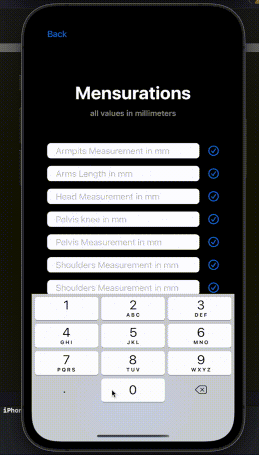

# fonrose-ecommerce-mobileapp-iOS-v2

## Principe

L’application permet la **vente de vêtements** sur-mesure en :
 - choisissant un **modèle disponible** (1 seul dans un premier temps)
 - renseignant **ses mensurations** dans cette dernière.

## Achat de la robe

L'utilisateur peut consulter les photos du produit et ensuite l'acheter via cet écran.
 
  
 

## Entrée des mensurations

L'utilisateur entre ses mensurations afin d'obtenir un vetêment sur mesure.
 
  
 

 ## Vidéo promotionnelle de la robe

 https://youtu.be/H3Fo-q35Mdk
